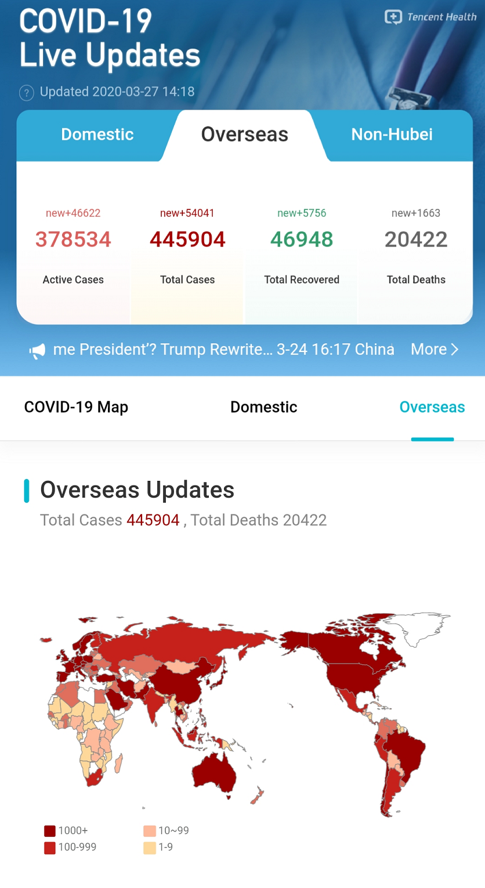

# TH_COVID19_International

COVID-19 Live Updates of Tencent Health is developed to track the live updates of COVID-19, including the global pandemic trends, domestic live updates, and overseas live updates.


## Display
[Preview](https://covid-19.th.qq.com)




## Project structure

    TH_COVID19_International
    |-- src                     # Source code
    |   |-- db                  # Database import script
    |   |-- servers             # Source code of Background
    |   |-- web                 # Souce code of Web
    |
    |-- images                  # images of Display


## Instructions

### Database Deployment

Path: 

    src/db/

Method:

    Import sql script under src/db/ in mysql


### Background Deployment

Path: 

    src/servers

Method:

1. `npm install`
2. Modify the configuration file under `/config/formal`, referring to the sample of  `/config/test`
3. Debug and execute `npm run dev` locally, will read the configuration file of `config/test`
4. Modify `start` command of `package.json` and configure `LOG_PATH`
5. Execute `npm run start` to run the program, will read the configuration files of `LOG_PATH` and `config/formal`

### Web Deployment

Path:

    src/web

Method:

#### Publish:

Build for pre environment

``` bash
npm run build:pre  
```
Build for production environment

```bash
npm run build  
```

#### Getting started:
```bash
npm install  
npm run dev  
```


